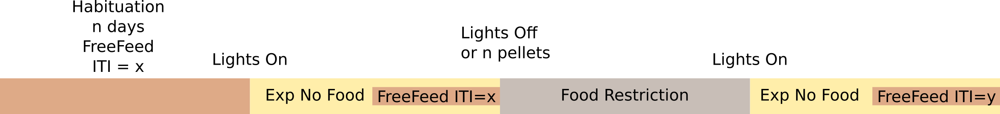

This is a FreeFeeding program that gives a pellet with an inter-trial-interval.
It follows an experimental paradigm shown in the diagram below.

It sends pulses on every event using [FEDWatcher](https://github.com/matiasandina/FEDWatcher).
Because of that, this folder contains Associated files to bypass the standard library and run from local files.

Check `version.txt` for a list of FED3 libraries that were tested with this program.
